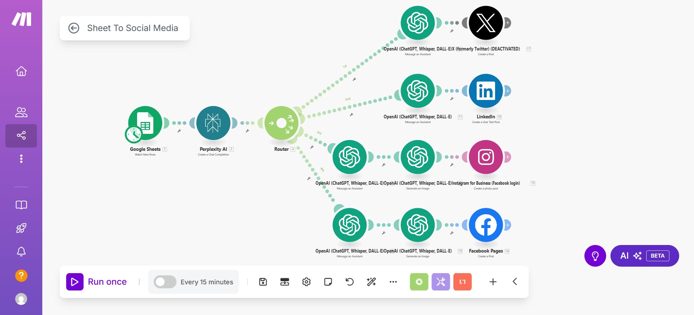

# sheet-to-social-automation
A fully automated social media posting system using Google Sheets, Perplexity AI, OpenAI, and MAKE.com
# 🧠 Sheet-to-Social Automation with MAKE.com

This project showcases a powerful AI-based social media automation built using [MAKE.com](https://www.make.com) (formerly Integromat). It automates social content generation and publishing from a simple Google Sheet using **Perplexity AI**, **OpenAI**, and major social platforms.

---

## 🔁 What It Does

✅ Fetches content from **Google Sheets**  
✅ Uses **Perplexity AI** to generate a smart post description  
✅ Uses **OpenAI GPT & DALL·E** to:
- Refine or rephrase content
- Generate an image  
✅ Posts automatically to:
- LinkedIn
- Instagram
- Facebook
- Twitter (optional)

Runs **every 15 minutes**, fully hands-free.

---

## ⚙️ Tools & APIs Used

- 📄 Google Sheets (as input source)
- 🧠 Perplexity AI (text generation)
- 🤖 OpenAI GPT & DALL·E (text & image generation)
- 📣 LinkedIn, Instagram, Facebook (publishing endpoints)
- 🔁 MAKE.com for orchestration

---

## 🖼️ Visual Flow

---

## 📌 Why This Matters

> This workflow replaces manual content creation and cross-platform posting, making it ideal for:
- Digital marketers
- YouTubers / creators
- AI-powered businesses

---

## 📂 Folder Contents

| File/Folder         | Description                         |
|---------------------|-------------------------------------|
| `README.md`         | This file                           |
| `assets/scenario.png` | Automation workflow image         |
| `scenario_description.md` | (Optional) More technical steps |

---

## 💡 Author

Made by **Muhammad Rayan Shahid**  
🎓 AI Enthusiast | Automation Builder | [ByteBrilliance AI](https://www.youtube.com/@ByteBrillianceAI)

---
